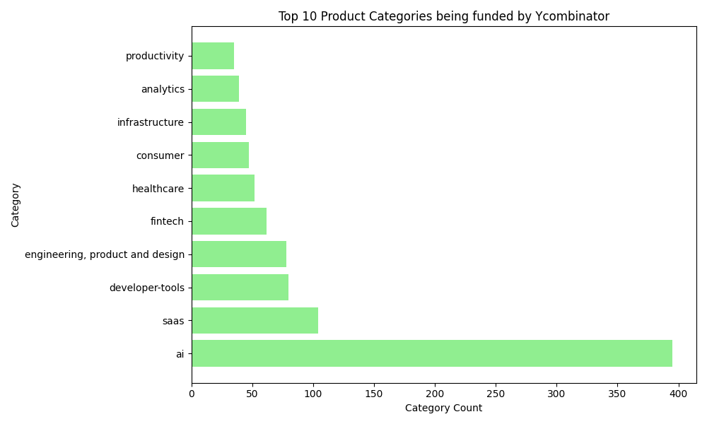
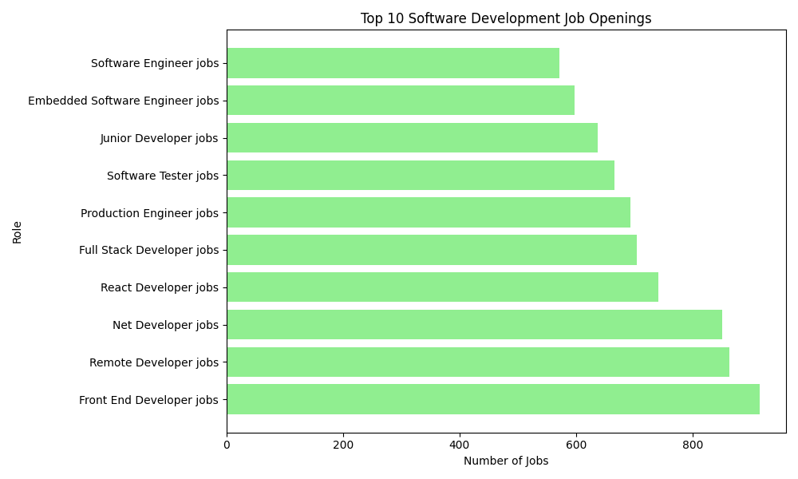
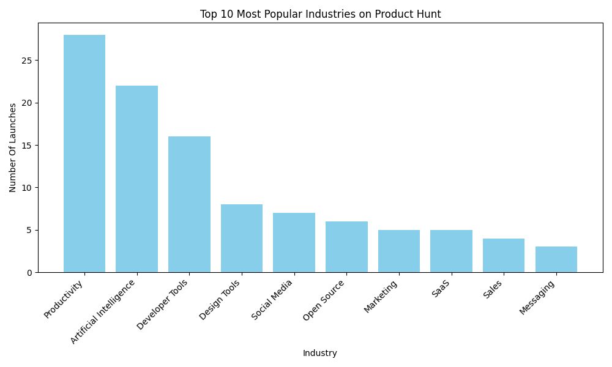

# Data-Driven Decisions: A Quick Overview of the Software Development Landscape

## Overview

As someone who loves to code, I often find myself going down the coding rabbit hole, where I make software just because, rather than to launch a viable validated product. I'm sure many developers and indie hackers can relate. However, I decided to start only making data-driven decisions. No coding until I have validated my idea and found a way to execute it. This approach ensures that each development effort is purposeful and backed by concrete insights, enhancing the overall efficiency and effectiveness of the product development process.

### Key Takeaways

- This report provides an overview of the Software Development landscape.
- Highlights key trends and dynamics in the tech industry.
- Offers insights into three main areas:
  - **Funding trends from Y Combinator**
  - **Software development job openings from Indeed (UK)**
  - **Performance of companies on Product Hunt**

Note: This report is designed to provide a quick but insightful overview of the software development landscape, allowing me to focus on building relevant products. It is not intended to be an exhaustive analysis, but rather a starting point for further exploration and idea generation.

## Funding Trends

This category provides an analysis of the top industries receiving funding from Y Combinator, highlighting the sectors that are currently attracting significant investment. Key insights include the dominance of artificial intelligence-related fields, along with other sectors like developer tools, SaaS, and healthcare.

The dominance of artificial intelligence-related fields in funding trends suggests a strong interest in AI-driven technologies and solutions, reflecting the increasing investment in AI across various industries. This trend is likely to continue, with AI becoming a key driver of innovation and growth in the tech industry.

Note: The tag 'AI' is a group of tags related to AI which include ai, generative-ai, artificial-intelligence, aiops, ai-assistant.

### Top 10 Product Categories being funded by Ycombinator:
 | Category | Category Count |
|----------|-------|
| ai | 395 |
| saas | 104 |
| developer-tools | 80 |
| engineering, product and design | 78 |
| fintech | 62 |
| healthcare | 52 |
| consumer | 47 |
| infrastructure | 45 |
| analytics | 39 |
| productivity | 35 |

### Sources
Source: [Y Combinator](https://www.ycombinator.com/companies?batch=W24&batch=S24&batch=S23) - Y Combinator is a renowned startup accelerator program known for funding and mentoring startups. Results are shown for batches s24, w24, s23 (2023-2024) 

## Jobs Data

This category presents a detailed examination of the most in-demand job titles in software development based on results from Indeed (UK), indicating the roles that companies are actively hiring for. Key insights include the high demand for Front End Developers, the prevalence of remote developer positions, and the specialization in specific technologies like React and.NET.

The high demand for Front End Developers and remote developer positions indicates the importance of web development skills in today's job market. The specialization in technologies like React and.NET highlights the need for proficiency in specific programming languages and frameworks, as well as the ability to adapt to emerging trends and technologies.

### Top 10 software development job titles by number of openings:
| Job Title | Job Openings |
|----------|-------|
| Front End Developer jobs | 915 |
| Front End Web Developer jobs | 915 |
| Remote Developer jobs | 863 |
| Net Developer jobs | 851 |
| React Developer jobs | 741 |
| Full Stack Developer jobs | 704 |
| Production Engineer jobs | 694 |
| Software Tester jobs | 666 |
| Junior Developer jobs | 637 |
| Embedded Software Engineer jobs | 598 |

**Role with most job openings:** Front End Developer jobs

**Total job openings:** 25824

**Average job openings:** 133

### Sources
Source: [Indeed](https://uk.indeed.com/browsejobs/Software-Development) - Indeed is a popular job search engine, providing a wide range of job listings across various industries, including software development.

## Industries and Products

This category focuses on the performance of companies and products on Product Hunt, a platform for showcasing and discovering new products. Key insights include the popularity of productivity tools, the prominence of artificial intelligence-driven solutions, and the demand for developer and design tools.

The popularity of productivity tools on Product Hunt reflects the growing demand for solutions that enhance efficiency and workflow management. The prominence of artificial intelligence-driven solutions underscores the importance of AI in driving innovation and product development, and highlights the need for companies to invest in AI research and development to stay competitive.

### Top 10 product hunt companies by number of upvotes:
| name | description | website | topics | upvotes | numberComments |
| --- | --- | --- | --- | --- | --- |
| Reflex | Build web apps in pure Python | https://www.producthunt.com/r/p/445480 | Web App,Open Source,Developer Tools | 999 | 141 |
| Musho | Your new AI design assistant | https://www.producthunt.com/r/p/451194 | Design Tools,Artificial Intelligence,Web Design | 928 | 112 |
| Airdrop Tracker | Discover 300+ largest web3 airdrops. Get AI recommendations | https://www.producthunt.com/r/p/445411 | Crypto,Artificial Intelligence | 910 | 107 |
| Boom | Make your meetings more engaging & fun on Zoom, Meet, Teams | https://www.producthunt.com/r/p/453322 | Mac,Design Tools | 910 | 121 |
| Lancepilot | Run WhatsApp marketing campaign, tracking, scheduling & CRM | https://www.producthunt.com/r/p/446568 | Messaging,Marketing | 875 | 358 |
| Komodo 2.0 | The fastest way to record your screen and interactive guides | https://www.producthunt.com/r/p/443345 | Productivity | 861 | 227 |
| SpeedLegal | Your personal AI contract negotiator | https://www.producthunt.com/r/p/449574 | SaaS,Legal,Artificial Intelligence | 858 | 194 |
| Subframe | The best way to build UI, fast | https://www.producthunt.com/r/p/452444 | Design Tools,Website Builder,Developer Tools | 852 | 163 |
| Assista AI | A central nervous system for all your productivity apps | https://www.producthunt.com/r/p/452215 | Productivity,Task Management | 833 | 198 |
| Draftboard | Referral bonuses for everyone | https://www.producthunt.com/r/p/450038 | Hiring,Career,Community | 817 | 157 |

### Top 10 product hunt companies by number of comments:
| name | description | website | topics | upvotes | numberComments |
| --- | --- | --- | --- | --- | --- |
| Lancepilot | Run WhatsApp marketing campaign, tracking, scheduling & CRM | https://www.producthunt.com/r/p/446568 | Messaging,Marketing | 875 | 358 |
| PaddleBoat | Perfect your sales pitch with realistic AI roleplays | https://www.producthunt.com/r/p/452547 | Sales,SaaS,Artificial Intelligence | 1 | 273 |
| deco.cx 2.0 | Build web apps 10x faster with Deno, JSX, TS & Tailwind | https://www.producthunt.com/r/p/442706 | A/B Testing,Developer Tools,Tech | 1 | 229 |
| Komodo 2.0 | The fastest way to record your screen and interactive guides | https://www.producthunt.com/r/p/443345 | Productivity | 861 | 227 |
| Supabase | The Postgres developer platform is now generally available | https://www.producthunt.com/r/p/451956 | Developer Tools,Database,SDK | 2 | 206 |
| Assista AI | A central nervous system for all your productivity apps | https://www.producthunt.com/r/p/452215 | Productivity,Task Management | 833 | 198 |
| BreezeDoc | Simple e-signature solution for freelancers and consultants | https://www.producthunt.com/r/p/449357 | Web App,Productivity | 632 | 198 |
| SalesPopup.io | The fastest way to boost your conversion rate | https://www.producthunt.com/r/p/449441 | Design Tools | 720 | 196 |
| SpeedLegal | Your personal AI contract negotiator | https://www.producthunt.com/r/p/449574 | SaaS,Legal,Artificial Intelligence | 858 | 194 |
| Retable | Airtable alternative - one tool to replace them all | https://www.producthunt.com/r/p/445749 | Productivity,Task Management,Spreadsheets | 767 | 194 |

### Top 10 performing categories on product hunt:
| Category | Product Launches |
|----------|-------|
| Productivity | 28 |
| Artificial Intelligence | 22 |
| Developer Tools | 16 |
| Design Tools | 8 |
| Social Media | 7 |
| Open Source | 6 |
| Marketing | 5 |
| SaaS | 5 |
| Sales | 4 |
| Messaging | 3 |

### Sources
Source: [Product Hunt](https://www.producthunt.com/leaderboard/monthly/2024/4) - Product Hunt is a platform for discovering and sharing new products. The leaderboard showcases the most popular products each month.

## Conclusion

In conclusion, this report provides valuable insights into key trends and dynamics in the tech industry. My findings highlight several important trends:

- **Funding Trends:** Artificial intelligence-related fields dominate funding trends, indicating a significant interest in AI-driven technologies. This is not a surprise given the ongoing AI hype. Other notable sectors include developer tools, SaaS, and healthcare.
- **Job Market Dynamics:** There is a high demand for Front End Developers and remote positions, showcasing the importance of web development skills and the growing trend of remote work. Specialization in technologies like React and .NET remains crucial.
- **Product Innovation:** On Product Hunt, productivity tools are highly popular, reflecting a demand for efficiency-enhancing solutions. AI-driven products and developer/design tools are also prominent, indicating key areas of innovation.

Based on these insights, here are some unique and creative product ideas to consider:

- **Blockchain-based authentication for AI agents:** A blockchain-based system that enables secure and decentralized authentication for AI agents, ensuring the integrity and trustworthiness of AI-driven decisions.
- **Freelance Project Manager:** A platform that helps freelance developers and clients communicate effectively, track project milestones, and manage expectations, addressing the growing trend of freelance work and the need for more efficient project management.
- **Personalized job matching platform for Front End Developers:** A platform that uses machine learning to match Front End Developers with job openings that fit their skills, experience, and preferences, addressing the high demand for Front End Developers and the need for more efficient job matching.
- **Design assistant for React component libraries:** A tool that uses AI to provide design suggestions and automate repetitive tasks for developers building React component libraries, addressing the popularity of React and the need for more efficient design workflows.
- **Deepfake Detection Tool:** A platform that uses AI-powered algorithms to detect and prevent deepfake scams, addressing the growing concern of deepfake fraud and the need for more secure online interactions.

Recently I have been trying to block out the noise and avoid building any AI related products unless I genuinely see how it adds value. AI is great but its still not cost efficient in many scenarios and has some other limitations. That being said, an area of AI which has my attention is Agents and specifically using them in existing systems to complete long-running tasks. AI should be used to enhance an already well-designed system not replace it. I see many people debating on whether or not AI is just hype but the data suggests its not. 

By analyzing the data presented, entrepreneurs and developers can gain a better understanding of market trends and make informed decisions to drive growth and innovation in their respective domains.

The tools I developed during this process, including data scrapers and the report generator, played a crucial role in gathering and presenting this information.

Want to receive free monthly reports like this one? Interested in learning more about tools that can boost your development process? [Join my Discord community](https://discord.gg/EFDkEDFr) or send a PM for exclusive insights and updates!

